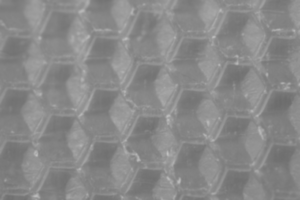
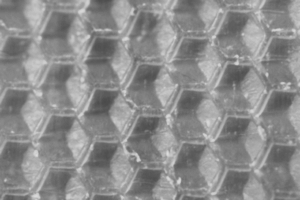
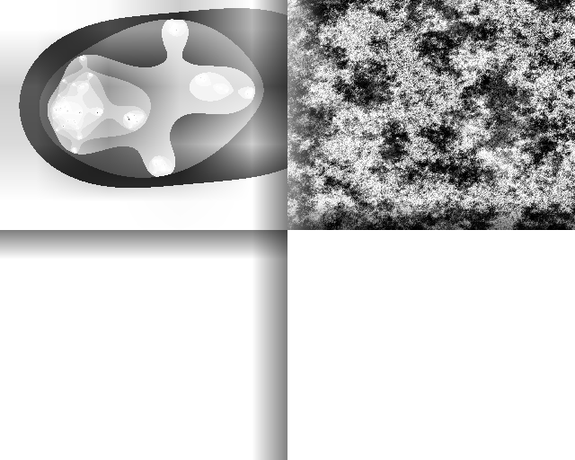
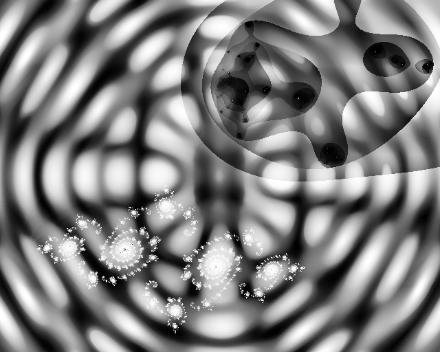

# clahe-rs

Reimplementation of opencv's CLAHE in pure rust.
This includes implementing u16 -> u8 conversion which was
missing in the other crates I tried.

Unlike the opencv version this:

- does not use threads (see future work, rayon could do this)
- does not do manual loop unrolls
- iterates over regions rather than lines during interpolation

Its unlikely this reaches the single-core throughput of the heavily optimized
opencv version (though I tried to maintain the structure that makes it
possible), if you are interested in making it faster let me know.

## Examples

|       Before        |          After          |
| :-----------------: | :---------------------: |
|   |   |
| :----------------:  | :--------------------:  |
|  |  |
| :----------------:  | :--------------------:  |
|     |     |

# Future work

- More performance testing
- Rayon threading
- Integrate into [imageproc crate](https://github.com/image-rs/imageproc]
